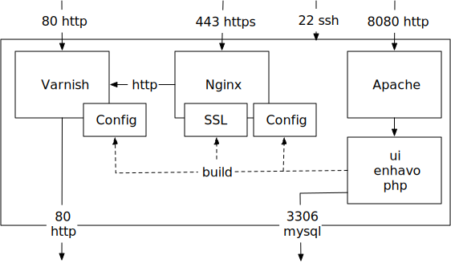

 
 

Enhavo Proxy
------------

The goal of enhavo proxy is to create a proxy with focus on load balancing and caching issue, which is easily to configure
over cli and a web interface. It supports SSL with own and Let's Encrypt certificates.

Enhavo proxy is made for docker, so it's easy to install on docker hosts.

Please don't use it for production unless we release version 1.0. We can't guarantee backward compatibility and we may
have still miss configuration.

Architecture
------------

We use varnish as proxy server. Varnish can't handle ssl request by default, so we use nginx to resolve https request.
We use apache only for the web interface, which is based on [enhavo](https://github.com/enhavo/enhavo).
The configuration is stored to a mysql database. If you apply the configuration they will be written to the filesystem and overwrite the configuration
files.

Contribution
------------

Feel free to contribute

MIT License
-----------

This software is free to use with MIT License